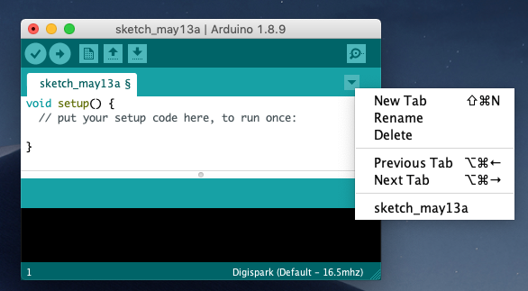

# BrocktonDemo2019

##About the code in general

Set up your Mac, PC, or Linux enviroment by [downloading the free Arduino](https://www.arduino.cc/en/Main/Software) Integrated Development Environment (IDE). 

The tiny board you have is a Digispark clone, and the additional software to use it is [here](https://digistump.com/wiki/digispark/tutorials/connecting). 

Most of the code is inside the `.ino` files. For the Tone/Melody program, also copy the contents of the `pitches.h` file to a new tab (name it `pitches.h` when it asks). 

##Rainbow RGB LED

[Original Tutorial at AdaFruit](https://learn.adafruit.com/adafruit-arduino-lesson-3-rgb-leds/arduino-sketch). Ours changed the following: redPin = 0, greenPin = 1, bluePin = 4. We also changed some of the colors because the brightness varies by which brand of RGB LED you use, your resistor values, etc. etc. 

[Number of colours in spectrum or rainbow](https://en.wikipedia.org/wiki/Rainbow#Number_of_colours_in_spectrum_or_rainbow). 

##Tone / Melody

The code is inside the `.ino` files. For the Tone/Melody program, also copy the contents of the `pitches.h` file to a new tab (name it `pitches.h` when it asks). 

[Original Tutorial at the official Arduino site](https://www.arduino.cc/en/Tutorial/ToneMelody), and our change was to move from pin 8 (which the DigiSpark clone does not have) to 0. You can use any pin marked `PMW` which I believe are 0, 1, 2, and 4. 

##Getting the Temperature on Digispark

Meter: Percent * 0.0825. 

This one didn't seem to work (the temperature goes up and down a lot). 

[Original Tutorial at DigiStump.com](https://digistump.com/wiki/digispark/quickref)
